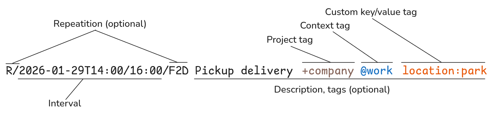

# icalendar.txt
Simple calendar format in plain text that can contain all data icalendar format supports 

This is adapation of [todo.txt's](https://github.com/todotxt/todo.txt) philosophy

## The format
The format is quite simple, one event one line
```
<interval> <description> @context +project custom_data:value
```



Some more examples so you get the idea

|Example|Explaination|
|--|--|
|`R/2026-01-28//F7D Take out garbage @chores`|Starting at 28th January repeats every 7 days for the whole day|
|`R/2026-02-10//F1Y John's birthday @birthdays`|Starting at 2nd February repeats every year for the whole day|
|`2026-02-16T10:00/11:00 Meeting with Mike @work`|2nd February from 10:00 to 11:00, could also be written as `2026-02-16T10:00/P1H ...`|
|`2026-02-20 Shippment arrival @work`|Whole day at 20th February|

- [`ISO8601 format`](https://en.wikipedia.org/wiki/ISO_8601)
- [`ISO8601 duration format`](https://en.wikipedia.org/wiki/ISO_8601#Durations)

